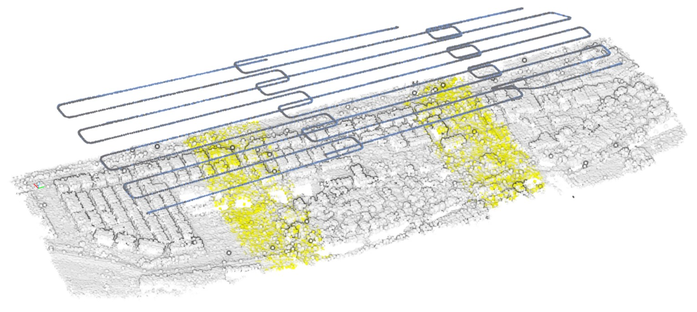

# Realtime2d_clusterfusion

关键技术：ORB-SLAM, Map2DFusion, Multi-task Coordinate Alignment, Global BA

youtube：https://youtube.com/watch?v=xxx

Credits:

[ORB_SLAM2](https://github.com/raulmur/ORB_SLAM2)

[Map2DFusion](https://github.com/zdzhaoyong/Map2DFusion)

